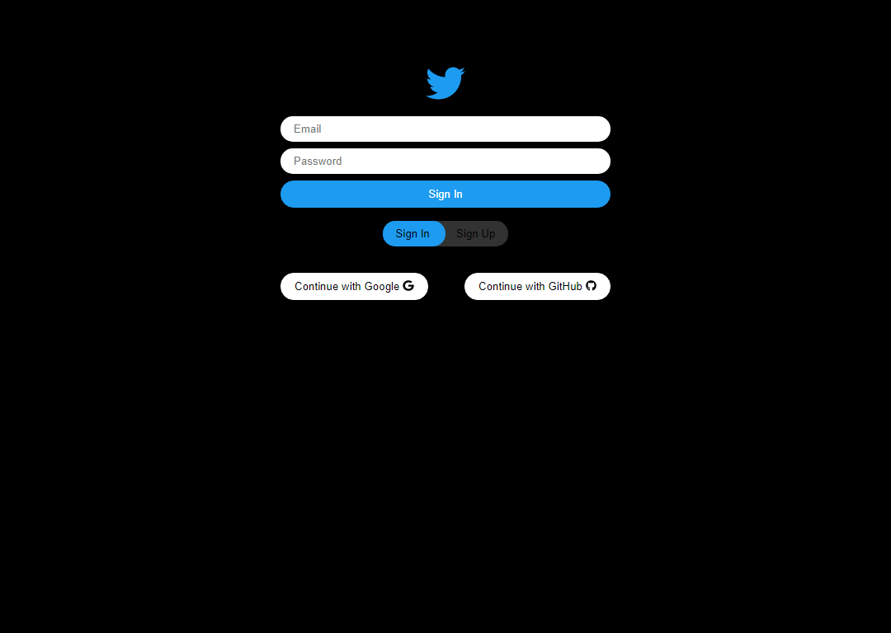
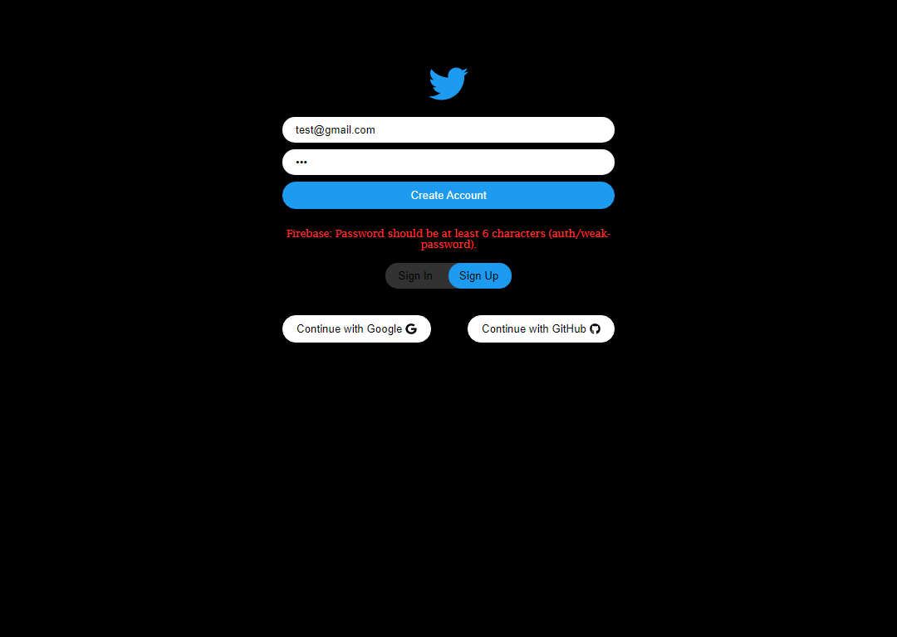
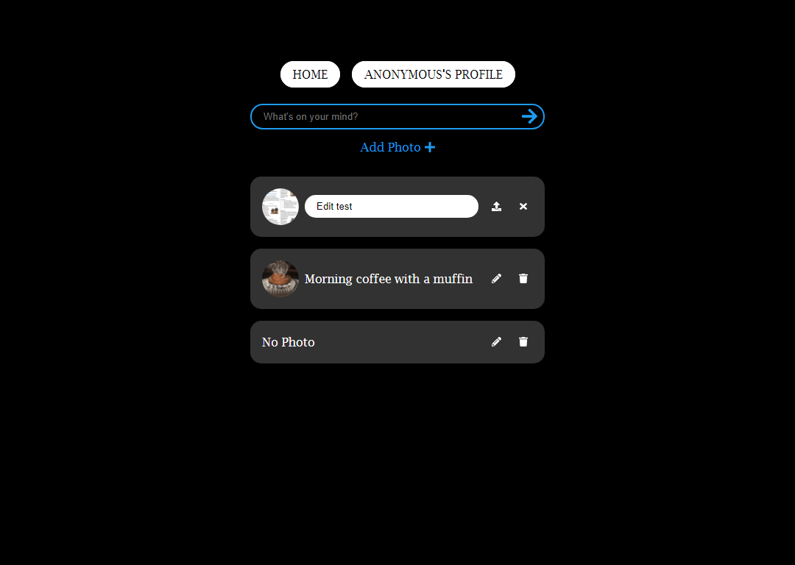
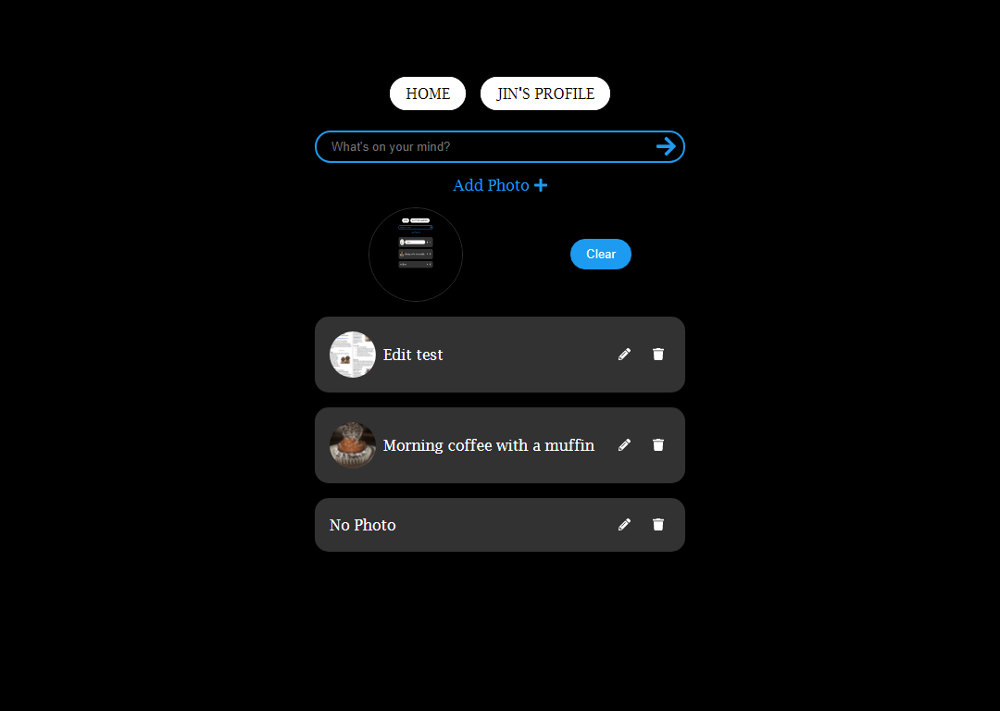
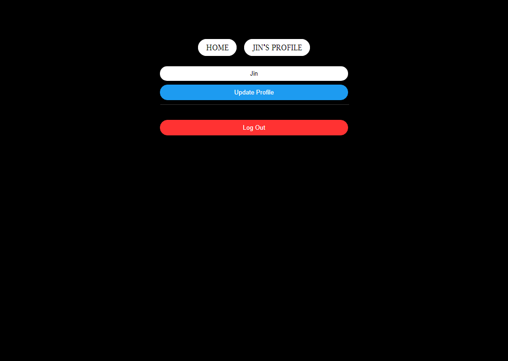

# Clone Twitter with Firebase (Web v9)

## Install Firebase

- `npm i firebase`

- Creating `fbase.js`

  - ```js
    import { initializeApp } from 'firebase/app';

    const firebaseConfig = {
      apiKey: 'AIza...',
      authDomain: '...',
      projectId: '...',
      storageBucket: '...',
      messagingSenderId: '...',
      appId: '...',
    };

    export default initializeApp(firebaseConfig);
    ```

- On `index.js`

  - `import './fbase';`

## Secure the Keys

- Make `.env` to root directory

  - Environmental variables need to start with `REACT_APP_`.

    - `REACT_APP_API_KEY=AIza...` // without `,` on the end of a line

- On `firebase.js`

  - `apiKey: process.env.REACT_APP_API_KEY,`

- Add `.env` to `.gitignore` to hide the Key on Github.

## Set up Router

- Create `Router.js` on \src\components

  - ```jsx
    import React, { useState } from 'react';
    import { HashRouter as Router, Routes, Route } from 'react-router-dom';
    import Auth from '../routes/Auth';
    import Home from '../routes/Home';

    // eslint-disable-next-line import/no-anonymous-default-export
    const AppRouter = () => {
      const [isLoggedIn, setIsLoggedIn] = useState(false);
      return (
        <Router>
          <Routes>
            {isLoggedIn ? (
              <Route path='/' element={<Home />}></Route>
            ) : (
              <Route path='/' element={<Auth />}></Route>
            )}
          </Routes>
        </Router>
      );
    };

    export default AppRouter;
    ```

- on `App.js`

  - ```jsx
    import React from 'react';
    import AppRouter from './Router';

    function App() {
      return <AppRouter />;
    }

    export default App;
    ```

## Set Absolute Imports

- You can configure your application to support importing modules using absolute paths. This can be done by configuring a `jsconfig.json` or `tsconfig.json` file in the root of your project.

  - on `jsconfig.json`

    - ```json
      {
        "compilerOptions": {
          "baseUrl": "src"
        },
        "include": ["src"]
      }
      ```

  - Change import path

## Set Up Firebase Auth

- Setting up Firebase Authentication

  - Sign-up method

    - Email/Password - Enable

    - Google - Enable

    - GitHub - Enable

      - Client ID and Client secret from GitHub

- GitHub - Developer Settings - OAuth Apps - New OAuth App

  - Application Name: twitter-clone

  - Homepage URL: https://twitter-clone-4cec7.firebaseapp.com (From firebase)

  - Authorization calllback URL: https://twitter-clone-4cec7.firebaseapp.com/__/auth/handler (From firebase)

## Add Login Form

- On `Auth.js`

  - ```js
    import React, { useState } from 'react';

    const Auth = () => {
      const [email, setEmail] = useState('');
      const [password, setPassword] = useState('');
      const onChange = (evt) => {
        const {
          target: { name, value },
        } = evt;
        if (name === 'email') {
          setEmail(value);
        } else if (name === 'password') {
          setPassword(value);
        }
      };
      const onSubmit = (evt) => {
        evt.preventDefault();
      };
      return (
        <div>
          <form onSubmit={onSubmit}>
            <input
              name='email'
              type='text'
              placeholder='Email'
              required
              value={email}
              onChange={onChange}
            />
            <input
              name='password'
              type='password'
              placeholder='Password'
              required
              value={password}
              onChange={onChange}
            />
            <input type='submit' value='Log In' />
          </form>
          <div>
            <button>Continue with Google</button>
            <button>Continue with GitHub</button>
          </div>
        </div>
      );
    };
    export default Auth;
    ```

## Create a New Account with Email and Password

- On `fbase.js`

  - ```js
    import { getAuth } from 'firebase/auth';

    export const auth = getAuth();
    ```

- On `Auth.js`

  - ```jsx
    import {
      createUserWithEmailAndPassword,
      signInWithEmailAndPassword,
    } from 'firebase/auth';
    import { auth } from 'fbase';

    const Auth = () => {
      ...
      const [newAccount, setNewAccount] = useState(true);
      const [error, setError] = useState('');
      ...
      const onSubmit = async (evt) => {
        evt.preventDefault();
        try {
          let data;
          if (newAccount) {
            data = await createUserWithEmailAndPassword(auth, email, password);
          } else {
            data = await signInWithEmailAndPassword(auth, email, password);
          }
        } catch (err) {
          setError(err.message);
        }
      };
      ...
      return (
        ...
        <input type='submit' value={newAccount ? 'Create Account' : 'Sign IN'} />
        {error}
    ```

## Log In with Email and Password

- On `App.js`

  - ```jsx
    import React, { useState, useEffect } from 'react';
    import AppRouter from 'components/Router';
    import { onAuthStateChanged } from 'firebase/auth';
    import { auth } from 'fbase';

    function App() {
      const [init, setInit] = useState(false);
      const [isLoggedIn, setIsLoggedIn] = useState(false);
      useEffect(() => {
        onAuthStateChanged(auth, (user) => {
          if (user) {
            setIsLoggedIn(true);
          } else {
            setIsLoggedIn(false);
          }
          setInit(true);
        });
      }, []);
      return (
        <>
          {init ? <AppRouter isLoggedIn={isLoggedIn} /> : 'Initializing...'}
          <footer>&copy; Cloning Twitter {new Date().getFullYear()}</footer>
        </>
      );
    }

    export default App;
    ```

- On `Auth.js`

  - ```jsx
    const toggleAccount = () => setNewAccount((prev) => !prev);
    return (
      <span onClick={toggleAccount}>
        {newAccount ? 'Sign In' : 'Create Account'}
      </span>
    ```

## Log In with Social

- On `Auth.js`

  - ```jsx
    import {
      ...
      signInWithPopup,
      GoogleAuthProvider,
      GithubAuthProvider,
    } from 'firebase/auth';

    const Auth = () => {
      ...
      const onSocialClick = async (evt) => {
        const {
          target: { name },
        } = evt;
        let provider;
        if (name === 'google') {
          provider = new GoogleAuthProvider();
        } else if (name === 'github') {
          provider = new GithubAuthProvider();
        }
        try {
          const data = await signInWithPopup(auth, provider);
          console.log(data);
        } catch (err) {
          console.log(err);
        }
      };
      return (
        ...
        <div>
          <button onClick={onSocialClick} name='google'>
            Continue with Google
          </button>
          <button onClick={onSocialClick} name='github'>
            Continue with GitHub
          </button>
        </div>
      );
    ```

## Log Out

- Create `Navigation.js`

  - ```jsx
    import React from 'react';
    import { Link } from 'react-router-dom';

    const Navigation = () => (
      <nav>
        <ul>
          <li>
            <Link to='/'>Home</Link>
          </li>
          <li>
            <Link to='/profile'>My Profile</Link>
          </li>
        </ul>
      </nav>
    );

    export default Navigation;
    ```

- On `Router.js`

  - ```jsx
    const AppRouter = ({ isLoggedIn }) => {
      return (
        <Router>
          {isLoggedIn && <Navigation />}
          <Routes>
            {isLoggedIn ? (
              <Route path='/'>
                <Route index element={<Home />} />
                <Route path='profile' element={<Profile />} />
              </Route>
            ) : (
              <Route path='/' element={<Auth />} />
            )}
          </Routes>
        </Router>
      );
    };
    ```

- On `Profile.js`

  - ```jsx
    import { useNavigate } from 'react-router-dom';
    import { signOut } from 'firebase/auth';
    import { auth } from 'fbase';

    const Profile = () => {
      const navigate = useNavigate();
      const onLogOutClick = async () => {
        try {
          await signOut(auth);
          navigate('/');
        } catch (err) {
          console.log(err);
        }
      };
      return <button onClick={onLogOutClick}>Log Out</button>;
    };
    ```

## Set up DB (firestore) and Add Document

- Create Firestore Database on Firebase

- On `fbase.js`

  - ```js
    import { getAuth } from 'firebase/auth';
    import { getFirestore } from 'firebase/firestore';

    const app = initializeApp(firebaseConfig);

    export const auth = getAuth();
    export const db = getFirestore(app);
    ```

- On `Home.js`

  - ```jsx
    import { collection, addDoc } from 'firebase/firestore';
    import { auth, db } from 'fbase';

    const Home = () => {
      const [ctwitt, setCtwitt] = useState('');
      const onSubmit = async (evt) => {
        evt.preventDefault();
        try {
          const docRef = await addDoc(collection(db, 'ctwitt'), {
            ctwitt,
            createdAt: Date.now(),
          });
          setCtwitt('');
        } catch (error) {
          console.log(error);
        }
      };
      const onChange = (evt) => {
        const {
          target: { value },
        } = evt;
        setCtwitt(value);
      };
      return (
        <div>
          <form>
            <input
              value={ctwitt}
              onChange={onChange}
              type='text'
              placeholder="What's on your mind?"
              maxLength={120}
            />
            <input type='submit' value='Cloning Twitter' onClick={onSubmit} />
          </form>
        </div>
      );
    };
    ```

## Get the Collection

- Show the collection on `Home.js`

  - ```jsx
    const Home = () => {
      const [ctwitts, setCtwitts] = useState([]);
      const getCtwitts = async () => {
        try {
          const ctwittsCol = collection(db, 'ctwitt');
          const ctwittSnapshot = await getDocs(ctwittsCol);
          const ctwittList = ctwittSnapshot.docs;
          // create objArray with id
          ctwittList.forEach((document) => {
            const ctwittObj = {
              ...document.data(),
              id: document.id,
            };
            setCtwitts((prev) => [ctwittObj, ...prev]);
          });
        } catch (error) {
          console.log(error);
        }
      };
      useEffect(() => {
        getCtwitts();
      }, []);
      return (
          {ctwitts.length > 0 ? (
            <ul>
              {ctwitts.map((ct) => (
                <li key={ct.id}>{ct.ctwitt}</li>
              ))}
            </ul>
          ) : null}
      );
    };
    ```

## Save User ID to database for edit

- On `App.js`

  - ```jsx
    function App() {
      ...
      // const [isLoggedIn, setIsLoggedIn] = useState(false);
      const [userObj, setUserObj] = useState(null);
      useEffect(() => {
        onAuthStateChanged(auth, (user) => {
          if (user) {
            // setIsLoggedIn(true);
            setUserObj(user);
            // } else {
            // setIsLoggedIn(false);
          } else {
            setUserObj(null)
          }
          setInit(true);
        });
      }, []);
      return (
        <>
          {init ? (
            // <AppRouter isLoggedIn={isLoggedIn} userObj={userObj} />
            <AppRouter isLoggedIn={Boolean(userObj)} userObj={userObj} />
          ) : (
            'Initializing...'
          )}
    ```

- On `Router.js`

  - ```jsx
    const AppRouter = ({ isLoggedIn, userObj }) => {
    return (
      ...
              <Route index element={<Home userObj={userObj} />} />
    ```

- On `Home.js`

  - ```jsx
    const Home = ({ userObj }) => {
      ...
    const getCtwitts = async () => {
      ...
          const ctwittObj = {
            ...document.data(),
            id: document.id,
            creatorId: userObj.uid,
    ```

## Database Realtime Updates from Firestore

### Get Collection

- On `Home.js`

  - ```js
    import {
      ...
      onSnapshot,
      query,
      orderBy,
    } from 'firebase/firestore';

    const Home = ({ userObj }) => {
      ...
      // const getCtwitts = async () => {
      //   try {
      //     const ctwittsCol = collection(db, 'ctwitt');
      //     const ctwittSnapshot = await getDocs(ctwittsCol);
      //     const ctwittList = ctwittSnapshot.docs;
      //     ctwittList.forEach((document) => {
      //       const ctwittObj = {
      //         ...document.data(),
      //         id: document.id,
      //        creatorId: userObj.uid,
      //       };
      //       setCtwitts((prev) => [ctwittObj, ...prev]);
      //     });
      //   } catch (error) {
      //     console.log(error);
      //   }
      // };
      useEffect(() => {
        // getCtwitts();
        const q = query(collection(db, 'ctwitt'), orderBy('createdAt', 'desc'));
        onSnapshot(q, (snapshot) => {
          const ctwittObj = snapshot.docs.map((doc) => ({
            id: doc.id,
            ...doc.data(),
            creatorId: userObj.uid,
          }));
          setCtwitts(ctwittObj);
        });
      }, []);
      ...
    ```

- Note: How is the data updated real-time even though using `useEffect(() => {},[]);`?

  - It's subscribed only once, but Firebase updates the data in real-time after subscribing.

### Delete and Update Data

- On `Home.js`

  - ```jsx
    import Ctwitt from 'components/Ctwitt';

      return (
        ...
        <ul>
          {ctwitts.map((ct) => (
            <Ctwitt
              key={ct.id}
              ctwittObj={ct}
              isOwner={ct.creatorId === userObj.uid}
            />
          ))}
        </ul>
        ...
      );
    ```

- Create `/components/Ctwitt.js`

  - ```jsx
    import React, { useState } from 'react';
    import { doc, deleteDoc, updateDoc } from 'firebase/firestore';
    import { db } from 'fbase';

    const Ctwitt = ({ ctwittObj, isOwner }) => {
      const [editing, setEditing] = useState(false);
      const [text, setText] = useState(ctwittObj.text);
      const onClickDelete = async () => {
        const ok = window.confirm(`Are you sure to delete ${ctwittObj.text}?`);
        if (ok) {
          await deleteDoc(doc(db, 'ctwitt', ctwittObj.id));
        }
      };
      const toggleEditing = () => setEditing((prev) => !prev);
      const onChangeCtwitt = (evt) => {
        const {
          target: { value },
        } = evt;
        setText(value);
      };
      const onSubmit = async (evt) => {
        evt.preventDefault();
        await updateDoc(doc(db, 'ctwitt', ctwittObj.id), {
          text,
        });
        setEditing(false);
      };
      return (
        <li>
          {editing ? (
            <>
              <form onSubmit={onSubmit}>
                <input
                  type='text'
                  value={text}
                  onChange={onChangeCtwitt}
                  required
                />
                <input type='submit' value='Update Ctwitt' />
              </form>
              <button onClick={toggleEditing}>Cancel</button>
            </>
          ) : (
            <>
              {text}
              {isOwner && (
                <>
                  <button onClick={toggleEditing}>Edit</button>
                  <button onClick={onClickDelete}>Delete</button>
                </>
              )}
            </>
          )}
        </li>
      );
    };

    export default Ctwitt;
    ```

## Preview Image

- `FileReader`

  - The `FileReader` object lets web applications synchronously read the contents of files (or raw data buffers) stored on the user's computer, using `File` or `Blob` objects to specify the file or data to read.

- On `Home.js`

  - ```jsx
    const onChangeFile = (evt) => {
      const {
        target: { files },
      } = evt;
      const theFile = files[0];
      const reader = new FileReader();
      reader.onloadend = (finishedEvent) => {
        const {
          currentTarget: { result },
        } = finishedEvent;
        setAttachment(result);
      };
      reader.readAsDataURL(theFile);
    };
    const onClickClearAttachment = (evt) => {
      evt.preventDefault();
      setAttachment('');
    };
    return (
      <div>
        <form>
          ...
          <input type='file' accept='image/*' onChange={onChangeFile} />
          <input type='submit' value='Cloning Twitter' onClick={onSubmit} />
          {attachment && (
            <div>
              
              <button onClick={onClickClearAttachment}>Clear</button>
            </div>
          )}
        </form>
        ...
      </div>
    );
    ```

## Upload File to Storage

- To create a random Universally Unique Identifier(UUID), `npm i uuid`

- `uploadString()` returns an `UploadTask` which you can use as a promise, or use to manage and monitor the status of the upload.

- On `fbase.js`

  - ```js
    import { getStorage } from 'firebase/storage';

    export const storage = getStorage(app);
    ```

- On `Home.js`

  - ```js
    import { v4 as uuidv4 } from 'uuid';
    import { ref, uploadString } from 'firebase/storage';
    import { db, storage } from 'fbase';

    const onSubmit = async (evt) => {
      evt.preventDefault();
      const fileRef = ref(storage, `${userObj.uid}/${uuidv4()}`);
      const response = await uploadString(fileRef, attachment, 'data_url');
      ...
    ```

## Get Uploaded File from Storage

- On `Home.js`

  - ```jsx
    import { ref, uploadString, getDownloadURL } from 'firebase/storage';

    const onSubmit = async (evt) => {
      evt.preventDefault();
      let attachmentURL = '';
      if (attachment !== '') {
        const attachmentRef = ref(storage, `${userObj.uid}/${uuidv4()}`);
        const response = await uploadString(
          attachmentRef,
          attachment,
          'data_url'
        );
        attachmentURL = await getDownloadURL(response.ref);
      }
      await addDoc(collection(db, 'ctwitt'), {
        text,
        createdAt: Date.now(),
        creatorId: userObj.uid,
        attachmentURL,
      });
      setText('');
      setAttachment('');
      const inputFile = document.querySelector('input[type="file"]');
      inputFile.value = '';
    };
    ```

- On `Ctwitt.js`

  - ```jsx
    {
      ctwittObj.attachmentURL && (
        
      );
    }
    ```

## Delete Uploaded File from Storage

- On `Ctwitt.js`

  - ```jsx
    import { deleteObject, ref } from 'firebase/storage';
    import { db, storage } from 'fbase';

    const onClickDelete = async () => {
      ...
        if (ctwittObj.attachmentURL !== '') {
          const attachmentRef = ref(storage, ctwittObj.attachmentURL);
          await deleteObject(attachmentRef);
        }
      }
    };
    ```

## Edit Profile

- On `Router.js`

  - ```jsx
    <Router>
      {isLoggedIn && <Navigation userObj={userObj} />}
      ...
            <Route path='profile' element={<Profile userObj={userObj} />} />
    ```

- On `Navigation.js`

  - ```jsx

    ```

    const Navigation = ({ userObj }) => (
    ...
    <Link to='/profile'>{userObj.displayName}'s Profile</Link>

    ```

    ```

- On `Profile.js`

  - ```jsx
    import React, { ..., useState } from 'react';
    import { ..., updateProfile } from 'firebase/auth';
    import { ..., db } from 'fbase';
    import { ..., collection, query, where, orderBy } from 'firebase/firestore';

    const Profile = ({ userObj }) => {
      const [newName, setNewName] = useState(userObj.displayName);
      ...
      useEffect(() => {
        const getMyCtwitts = async () => {
          const q = query(
            collection(db, 'ctwitt'),
            where('creatorId', '==', userObj.uid),
            orderBy('createdAt', 'desc')
          );
          const ctwitts = await getDocs(q);
          console.log(ctwitts.docs.map((doc) => doc.data()));
        };
        getMyCtwitts();
      }, [userObj.uid]);
      const onChange = (evt) => {
        const {
          target: { value },
        } = evt;
        setNewName(value);
      };
      const onSubmit = async (evt) => {
        evt.preventDefault();
        if (userObj.displayName !== newName) {
          await updateProfile(userObj, { displayName: newName });
        }
      };
      return (
        <>
          <form>
            <input
              type='text'
              placeholder='display name'
              onChange={onChange}
              value={newName}
            />
            <input type='submit' onClick={onSubmit} />
          </form>
          <button onClick={onLogOutClick}>Log Out</button>
        </>
      );
    };
    ```

- `FirebaseError: The query requires an index.`

  - Cloud Firestore uses composite indexes for compound queries not already supported by single field indexes (ex: combining equality and range operators).

  - If you change the compound queries, you need to create an index for the changed one.

  - Click the link on the error notice and create an index.

### Update DisplayName Realtime

- Refresh `userObj` when it's updated

- On `App.js`

  - ```jsx
    const refreshUserName = () => {
      setUserObj(auth.currentUser)
    }
    ...
          <AppRouter refreshUserName={refreshUserName} isLoggedIn={Boolean(userObj)} userObj={userObj} />
    ```

- On `Router.js`

  - ```jsx
    const AppRouter = ({ refreshUserName, ... }) => {
      ...
                <Route
                  path='profile'
                  element={<Profile userObj={userObj} refreshUserName={refreshUserName} />}
    ```

- On `Profile.js`

  - ```jsx
    const Profile = ({ ..., refreshUserName }) => {
      ...
      const onSubmit = async (evt) => {
        ...
        refreshUserName();
      };
    ```

#### Issue: When the new object are pointing to the same reference with the old object, React is not going to update the state.

- Solution 1: Save the User to a new reference.

  - On `App.js`

    - ```jsx
      const refreshUserName = () => {
        setUserObj({ ...auth.currentUser });
      };
      ```

  - Issue: getIdToken is not function

    - On `Profile.js`

      - ```jsx
        if (userObj.displayName !== newName) {
          await updateProfile(auth.currentUser, { displayName: newName });
        }
        ```

- Solution 2: Set displayName as a new state

  - On `App.js`

    - ```jsx
      const [newUserName, setNewUserName] = useState('');

      const refreshUserName = () => {
        const user = auth.currentUser;
        setNewUserName(user.displayName);
      };
      ```

## Clean Code

### Refactoring ctwitt form on `Home.js`

- Move the ctwitt form from `Home.js` to `CtwittFactory.js`

  - ```jsx
    import React, { useState } from 'react';
    import { v4 as uuidv4 } from 'uuid';
    import { collection, addDoc } from 'firebase/firestore';
    import { ref, uploadString, getDownloadURL } from 'firebase/storage';
    import { db, storage } from 'fbase';

    const CtwittFactory = ({ userObj }) => {
      const [text, setText] = useState('');
      const [attachment, setAttachment] = useState('');
      const onSubmit = async (evt) => {
        evt.preventDefault();
        let attachmentURL = '';
        if (attachment !== '') {
          const attachmentRef = ref(storage, `${userObj.uid}/${uuidv4()}`);
          const response = await uploadString(
            attachmentRef,
            attachment,
            'data_url'
          );
          attachmentURL = await getDownloadURL(response.ref);
        }
        await addDoc(collection(db, 'ctwitt'), {
          text,
          createdAt: Date.now(),
          creatorId: userObj.uid,
          attachmentURL,
        });
        setText('');
        setAttachment('');
        const inputFile = document.querySelector('input[type="file"]');
        inputFile.value = '';
      };
      const onChange = (evt) => {
        const {
          target: { value },
        } = evt;
        setText(value);
      };
      const onChangeFile = (evt) => {
        const {
          target: { files },
        } = evt;
        const theFile = files[0];
        const reader = new FileReader();
        reader.onloadend = (finishedEvent) => {
          const {
            currentTarget: { result },
          } = finishedEvent;
          setAttachment(result);
        };
        reader.readAsDataURL(theFile);
      };
      const onClickClearAttachment = (evt) => {
        evt.preventDefault();
        setAttachment('');
      };
      return (
        <form>
          <input
            value={text}
            onChange={onChange}
            type='text'
            placeholder="What's on your mind?"
            maxLength={120}
          />
          <input type='file' accept='image/*' onChange={onChangeFile} />
          <input type='submit' value='Cloning Twitter' onClick={onSubmit} />
          {attachment && (
            <div>
              
              <button onClick={onClickClearAttachment}>Clear</button>
            </div>
          )}
        </form>
      );
    };

    export default CtwittFactory;
    ```

### Refactoring Log In Form with Email and Password

- Move the form from `Auth.js` to `AuthForm.js`

  - ```jsx
    import React, { useState } from 'react';
    import {
      createUserWithEmailAndPassword,
      signInWithEmailAndPassword,
    } from 'firebase/auth';
    import { auth } from 'fbase';

    const AuthForm = () => {
      const [email, setEmail] = useState('');
      const [password, setPassword] = useState('');
      const [newAccount, setNewAccount] = useState(true);
      const [error, setError] = useState('');
      const onChange = (evt) => {
        const {
          target: { name, value },
        } = evt;
        if (name === 'email') {
          setEmail(value);
        } else if (name === 'password') {
          setPassword(value);
        }
      };
      const onSubmit = async (evt) => {
        evt.preventDefault();
        try {
          let data;
          if (newAccount) {
            data = await createUserWithEmailAndPassword(auth, email, password);
          } else {
            data = await signInWithEmailAndPassword(auth, email, password);
          }
          console.log(data);
        } catch (err) {
          setError(err.message);
        }
      };
      const toggleAccount = () => setNewAccount((prev) => !prev);
      return (
        <>
          <form onSubmit={onSubmit}>
            <input
              name='email'
              type='text'
              placeholder='Email'
              required
              value={email}
              onChange={onChange}
            />
            <input
              name='password'
              type='password'
              placeholder='Password'
              required
              value={password}
              onChange={onChange}
            />
            <input
              type='submit'
              value={newAccount ? 'Create Account' : 'Sign In'}
            />
            {error}
          </form>
          <span onClick={toggleAccount}>
            {newAccount ? 'Sign In' : 'Create Account'}
          </span>
        </>
      );
    };

    export default AuthForm;
    ```

### Fix Null displayName

- On `Navigation.js`

  - `<Link to='/profile'>{userObj.displayName ?? 'Anonymous'}'s Profile</Link>`

- On `Profile.js`

  - `const [newName, setNewName] = useState(userObj.displayName ?? 'Anonymous');`

## Styles

- Created `src\styles.css`

  - On `index.js`, put `import 'styles.css';`

- Sign In or Up Switch animation

  - On `AuthForm.js`

    - ```jsx
      const [signInActive, setSignInActive] = useState(false);
      ...
      const onClickSwitch = (evt) => {
        const {target: {name}} = evt;
        if(name === 'signIn') {
          setNewAccount(false);
          setSignInActive(true);
        }
        if(name === 'signUp') {
          setNewAccount(true);
          setSignInActive(false);
        }
      }
      ...
          <div className="authSwitch">
            <button onClick={onClickSwitch} name="signIn" className={signInActive ? 'activeSwitch' : ''}>Sign In</button>
            <button onClick={onClickSwitch} name="signUp" className={!signInActive ? 'activeSwitch' : ''}>Sign Up</button>
          </div>
      ```

  - On `styles.css`

    - ```css
      .authSwitch {
        margin-bottom: 2rem;
        background-color: rgb(41, 41, 41);
        border-radius: var(--border-radius);
        z-index: 1;
        position: relative;
        width: 170px;
        display: flex;
        justify-content: space-between;
      }
      .authSwitch button {
        padding: var(--btn-padding);
        background-color: transparent;
        color: white;
        border: none;
      }
      @keyframes switch {
        from {
          left: 0;
          right: 100%;
        }
        to {
          left: 50%;
          right: 0;
        }
      }
      .authSwitch button.activeSwitch::after {
        content: '';
        position: absolute;
        top: 0;
        bottom: 0;
        background-color: var(--blue);
        width: 50%;
        border-radius: var(--border-radius);
        z-index: -1;
        animation-name: switch;
        animation-duration: 0.4s;
        animation-fill-mode: forwards;
        animation-timing-function: ease-in;
      }
      .authSwitch button[name='signIn'].activeSwitch::after {
        animation-direction: reverse;
      }
      .authSwitch button:hover:not(.activeSwitch) {
        font-weight: bold;
      }
      ```

### FontAwesome V5

- Install `fontawesome v5`

  - ```bash
    npm i @fortawesome/fontawesome-svg-core
    npm i @fortawesome/free-solid-svg-icons @fortawesome/free-brands-svg-icons @fortawesome/free-regular-svg-icons
    npm i @fortawesome/react-fontawesome
    ```

- Use the Icon

  - ```jsx
    import { ICON-NAME } from '@fortawesome/ICON-TYPE';

    <FontAwesomeIcon icon={ICON-NAME} />
    ```

- via Global Use, `library.add()`

  - ```jsx
    import ReactDOM from 'react-dom';
    import { library } from '@fortawesome/fontawesome-svg-core';
    import { fab } from '@fortawesome/free-brands-svg-icons';
    import { faCheckSquare, faCoffee } from '@fortawesome/free-solid-svg-icons';

    library.add(fab, faCheckSquare, faCoffee);
    ```

  - it's passing

    - `fab`: which represents all of the brand icons in `@fortawesome/free-brands-svg-icons`. So any of the brand icons in that package may be referenced by icon name as a string anywhere else in our app. For example: `apple`, `microsoft`, or `google`.

    - `faCheckSquare` and `faCoffee`: Adding each of these icons individually allows us to refer to them throughout our app by their icon string names, `check-square` and `coffee`, respectively.

  - examples

    - ```jsx
      import React from 'react';
      import { FontAwesomeIcon } from '@fortawesome/react-fontawesome';

      <FontAwesomeIcon icon={['fab', 'apple']} />
      <FontAwesomeIcon icon="check-square" />
      ```

- Features

  - size: `<FontAwesomeIcon icon="coffee" size="2x" />`

  - rotation: `<FontAwesomeIcon icon="coffee" rotation={90} />`

  - flip(horizontal, vertical, both): `<FontAwesomeIcon icon="coffee" flip="horizontal" />`

  - pull(left, right): `<FontAwesomeIcon icon="coffee" pull="left" />`

  - transform

    - ```jsx
      <FontAwesomeIcon icon="coffee" transform="shrink-6 left-4" />
      <FontAwesomeIcon icon="coffee" transform={{ rotate: 42 }} />
      ```

  - mask: `<FontAwesomeIcon icon="coffee" mask={['far', 'circle']} />`

  - `fixedWidth`, `inverse`, `listItem`, `spin`, `pulse`, `border`,

  - Layering Icons

    - ```jsx
      <span className="fa-layers fa-fw">
        <FontAwesomeIcon icon="square" color="green" />
        <FontAwesomeIcon icon="check" inverse transform="shrink-6" />
      </span>

      <span class="fa-layers fa-fw" style="background:MistyRose">
        <i class="fas fa-play" data-fa-transform="rotate--90 grow-2"></i>
        <i class="fas fa-sun fa-inverse" data-fa-transform="shrink-10 up-2"></i>
        <i class="fas fa-moon fa-inverse" data-fa-transform="shrink-11 down-4.2 left-4"></i>
        <i class="fas fa-star fa-inverse" data-fa-transform="shrink-11 down-4.2 right-4"></i>
      </span>

      <span class="fa-layers fa-fw" style="background:MistyRose">
        <i class="fas fa-certificate"></i>
        <span class="fa-layers-text fa-inverse" data-fa-transform="shrink-11.5 rotate--30" style="font-weight:900">NEW</span>
      </span>

      <span class="fa-layers fa-fw" style="background:MistyRose">
        <i class="fas fa-envelope"></i>
        <span class="fa-layers-counter" style="background:Tomato">1,419</span>
      </span>
      ```

- The results

  
  
  
  
  
